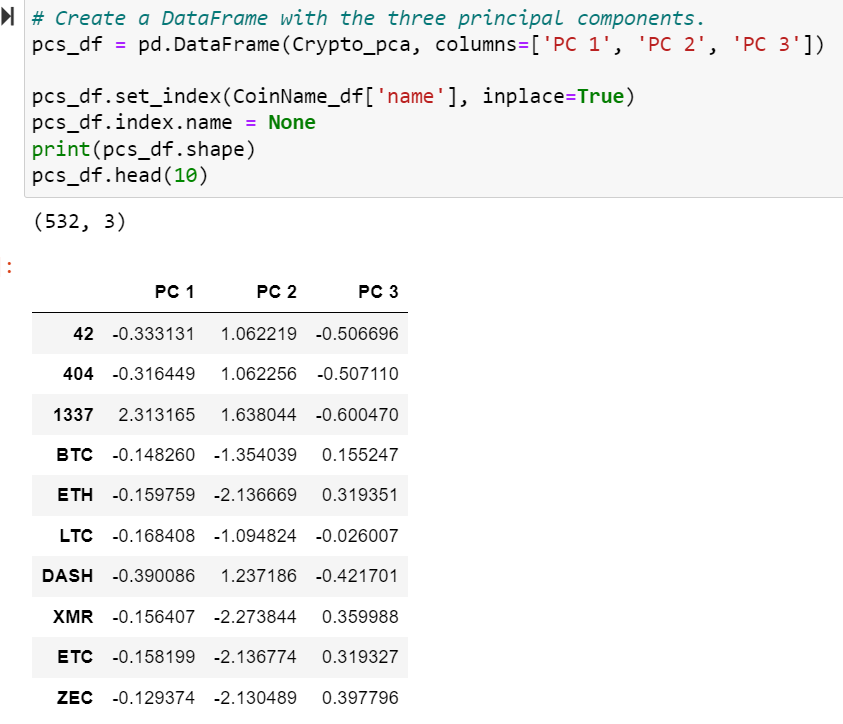
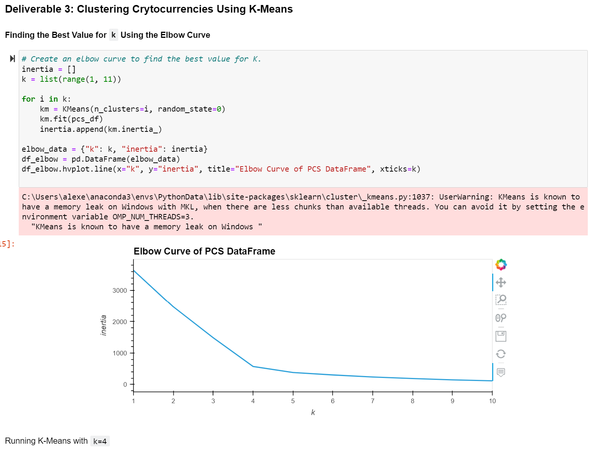
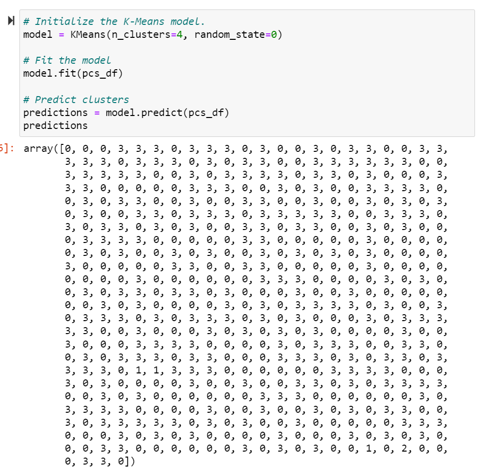
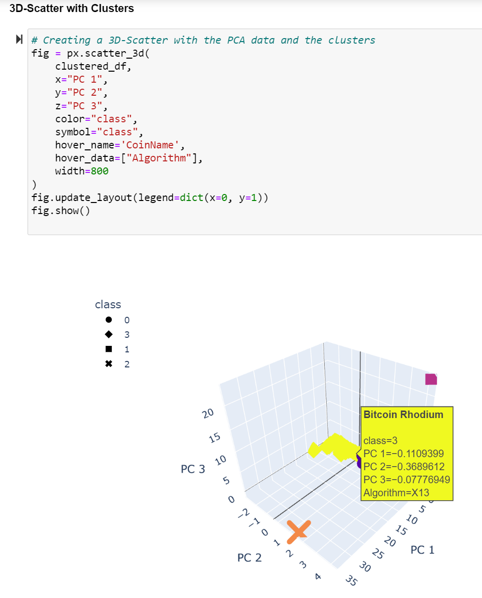
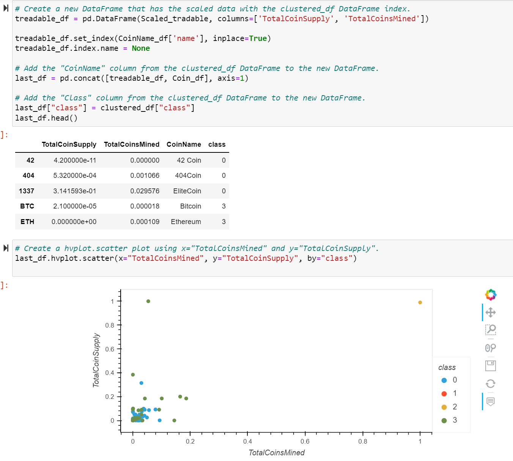

# Cryptocurrencies

# Purpose

Use Unsupervised Machine Learning predict bitcoins that will be profitable.

# Process 

- Eliminate null values
- Remove unuseable variables
- Identify and select operating crypto
- Identify and select coin producing crypto
- Scale the cleaned data

# Results

## Clustered Numbers (K)

- Compile left over features into 3 principal components

- An Elbow Curce shows how many clusters I should use. The angle pinched at 4 clusters.

# K - Means

- Construct, align, and edit the model to create predictions 

# Summary

A 3-D diagram and scatter plot allowed for easy view of outliers. In the upper right and lower left corners of the 3-D diagram lies the outliers. In the scatter plot shown, the outliers are Class 2 and 3 bitcoins.

3D 

Scatter Plot

